# Annotation Pipeline (APL)

## Installation

### For Development Server
APL was developed with Python2.7. If you do not have a Python2.7 environment you can set one
up using anaconda or virtualenv. Running a development server for APL is not difficult,
but you will need Redis installed on your machine before you attempt to run these instructions:

    cd source
    pip install -r requirements.txt
    redis-server &
    python development.py

### Via Docker
#### Configuration
Since this will be how you will run a production server, you'll need to configure the
app properly for a production environment.

    touch prod_config.py

Then enter the prod_config.py file with a text editor and add the following information:

    REDIS = {
        'host': 'apl-redis',
        'port': 6379,
        'db': 0,
    }
    SECRET_KEY = 'XXX'

`SECRET_KEY` should be changed to whatever you deem appropriate however.

#### Finalize
Running the annotation pipeline will require Docker to be installed on your computer.
Docker is a flexible piece of software that can quickly deploy complex applications
in a reproducible manner.  You will need to install Docker and Docker-Compose.
Instructions for this can be readily found on Google for your operating system. Once
Docker and Docker-Compose are installed you can execute the following command on the
CLI

    docker-compose up

## Usage
Usage of APL is designed to be as simple as possible to untrained users.

### Sign-In / Sign-Up
Sign-In is accomplished by entering a username, while sign-up is done by entering a username and an email address.
We currently have not implemented password protection mechanisms because we haven't
found a need for it yet, but if multi-center users desire to use the same APL instance
then password protection will undoubtedly be necessary.
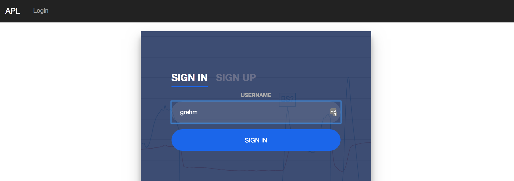
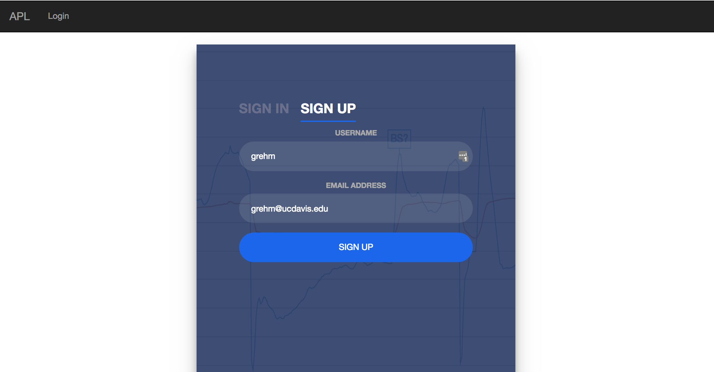

### Annotation Views
Normally users can just choose an annotation view. After choosing a view a list of
metadata and annotation options will be displayed to ensure the correct view has
been chosen.

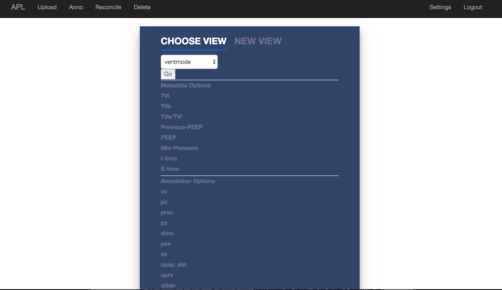

Users can also create a new annotation view if they desire to as well.
New annotation views will be marked with a username to ensure proper attribution is
made.

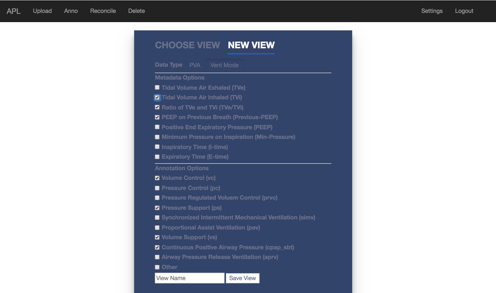

### Upload and Choosing a File

Upload occurs using files collected from the Puritan Bennet 840 ventilator. The
files are then analyzed with the ventmap software and processed into a form that
is able to be rendered by APL.

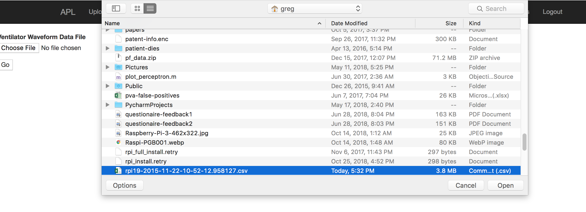

Files can then be chosen via drop-down menu.

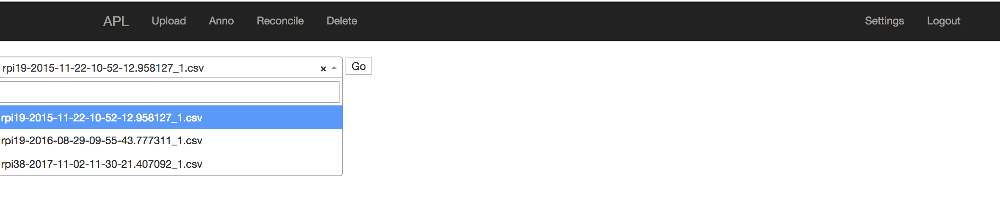

### Annotating a File

Annotating a file can begin after a view and a file are chosen to annotate.

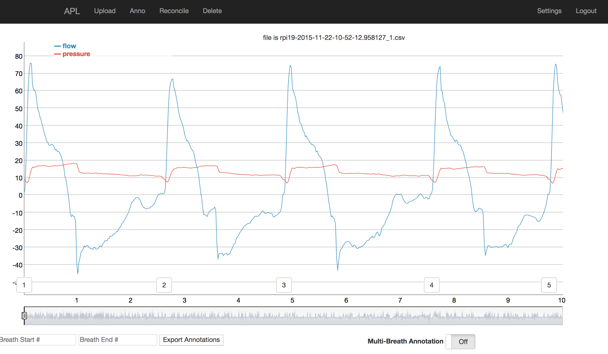

Annotation occurs simply by clicking on a breath number and by clicking a checkbox associated
with a breath annotation. Breaths that are not annotated are assumed to be normal.

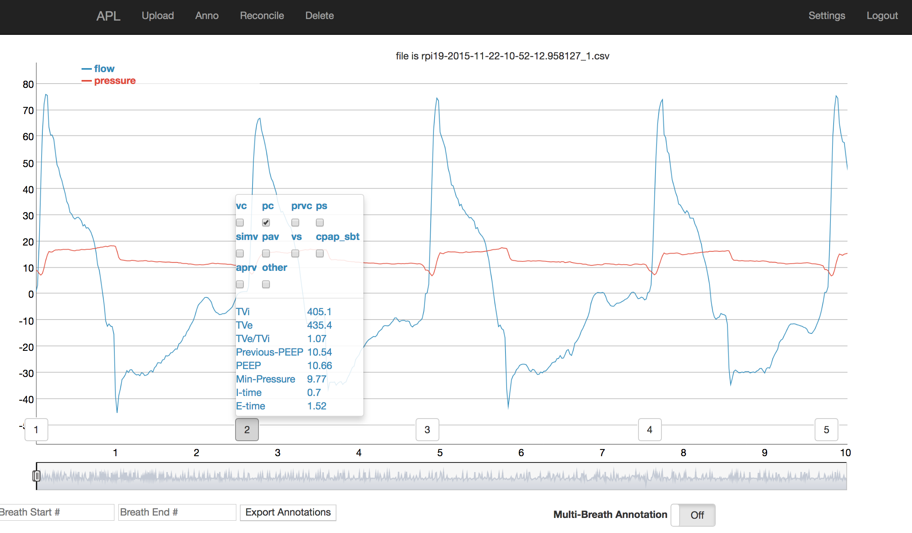

If multiple breaths at once are desired to be annotated then a user simply picks
a breath to start annotations at, and then selects a breath to end annotations, and
all intermediate breaths will be automatically annotated.

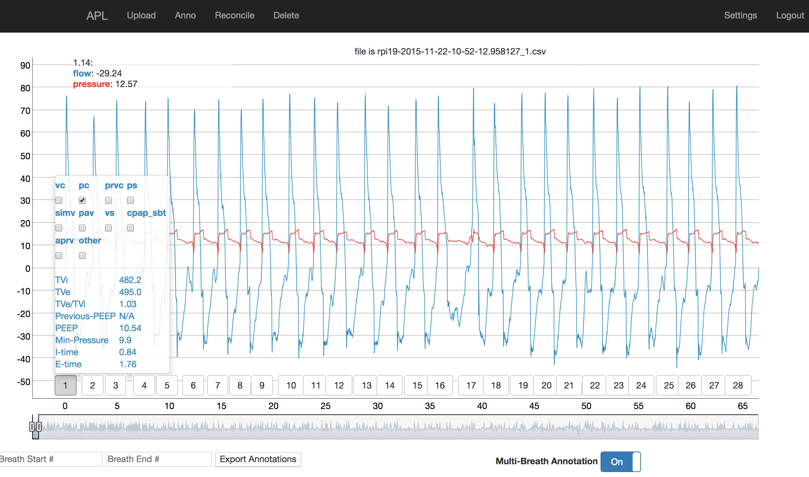
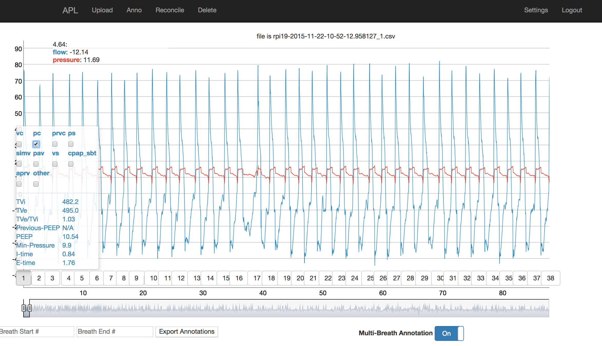
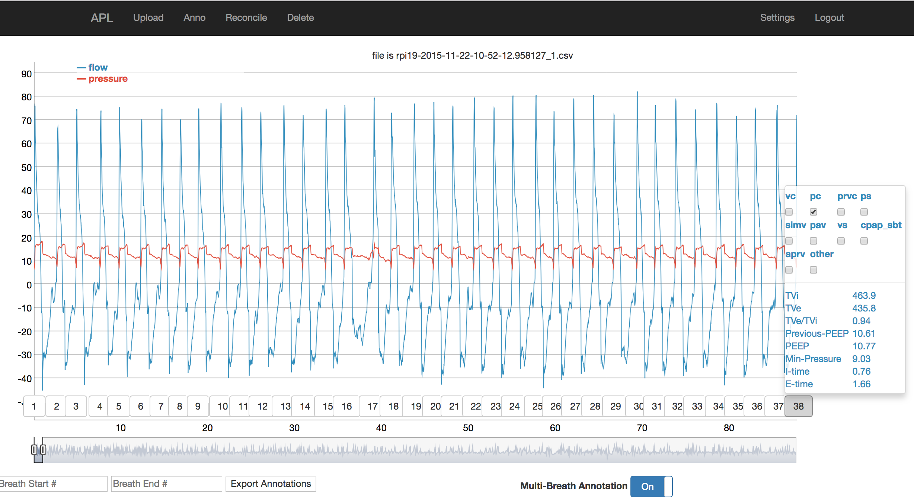

Annotations can be exported to CSV format by clicking a button at the bottom left
of the annotation screen. There is also option for output of a specific breath
range of annotations as well.

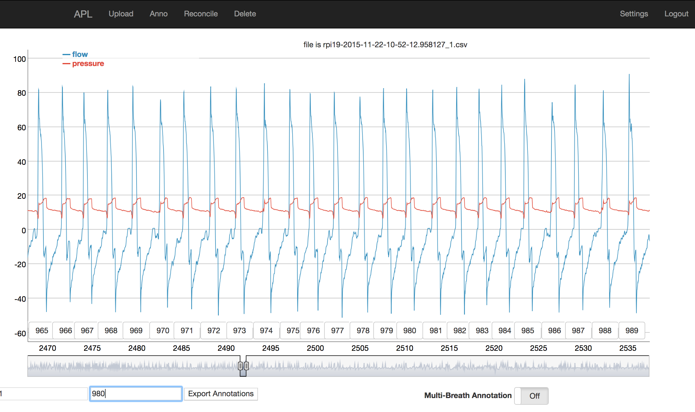

### Reconciliation

Assuming that another reviewer has annotated the same file you are working on, in the
same view then you can select the file you want to reconcile and the name of the
reviewer you want to reconcile against.

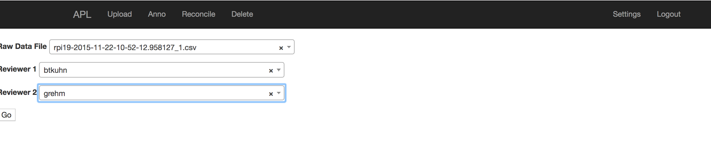

If there are no breaths that need to be reconciled then all breaths will have a green checkmark above them.

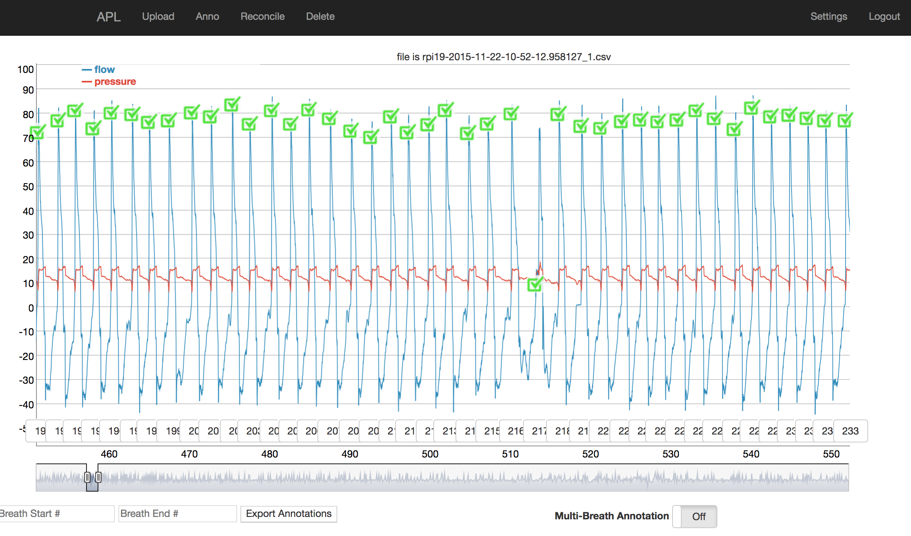

If breaths need to be reconciled, then breaths will appear with a red label above them, marking the differing choices each reviewer made when annotating them.

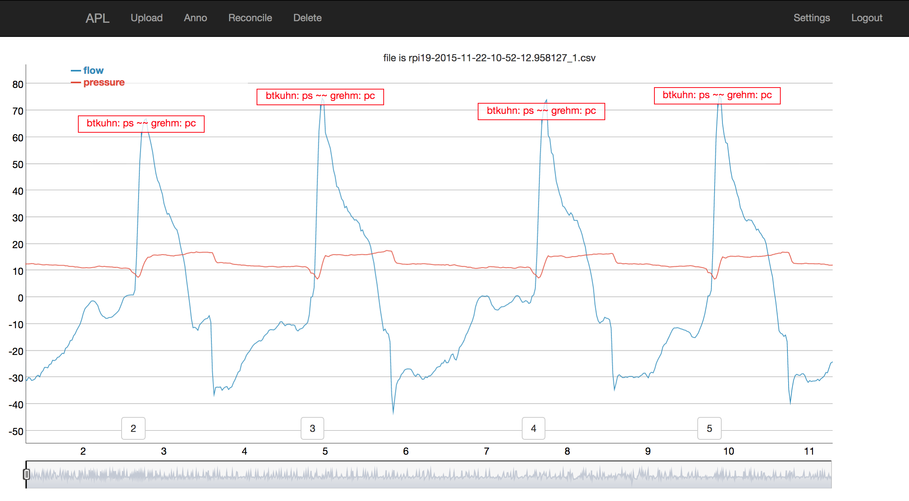

Importantly, breaths needing reconciliation will have differing annotations be unchecked, allowing for tabula rasa of choice.

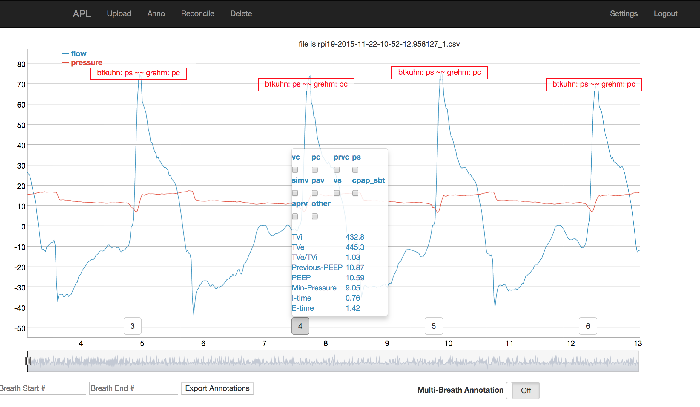

### Deleting Files

If files need to be deleted from APL to clear space then that is possible via the
`Delete` Tab. Here users have option of deleting single files, or all files if
space needs to be quickly found.

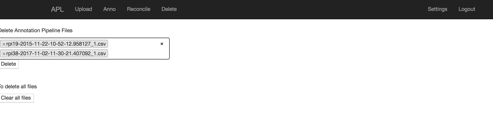
